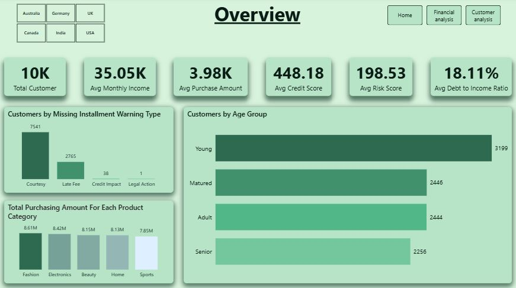
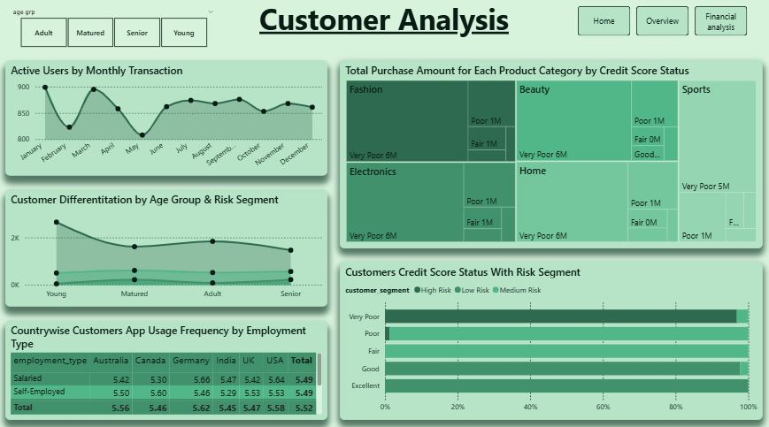
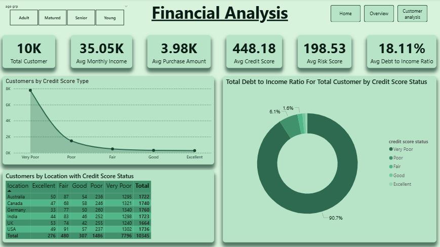

# Buy Now Pay Later (BNPL) Credit Risk & Default Analytics Dashboard

---

## Table of Contents

*   [Project Overview](#-project-overview)
    *   [Business Objective](#-business-objective)
*   [Dashboard Preview Section](#-dashboard-preview)
*   [Key Features](#-key-features)
*   [Tech Stack](#-tech-stack)
*   [Dataset Architecture](#-dataset-architecture)
*   [Data Cleaning & Tranfromation Pipeline (ETL)](#-data-cleaning--transformation-pipeline)
*   [Data Modeling](#-data-modeling)
*   [Strategic Business Insights](#-strategic-business-insights)
*   [Key Performance Indicators (KPIs) Summary](#-key-performance-indicator)
*   [Installation & Usage](#-installation--usage)
*   [Author & Contact](#author--contact)

## 📊 Project Overview
This project delivers a production-grade **Buy Now Pay Later (BNPL) Credit Risk & Delinquency Management System** engineered in Power BI. With the rapid expansion of alternative lending models within Fintech, managing portfolio default vectors without damaging consumer conversion is paramount. 

This analytical application processes real-time behavioral data, socio-economic signals, and classical credit profiles to construct deep risk visibilities. By establishing structured metric layers over transactional histories, this dashboard enables risk management teams, underwriters, and product managers to isolate systemic risks, prevent operational credit slippage, and monitor bad debt metrics across international boundaries.

### 🎯 Business Objective
* Identify credit defaults early to protect corporate working capital.
* Correlate user attributes like employment type, debt-to-income (DTI) ratio, and app behavioral patterns to refine localized limits.
* Optimize systemic collection interventions based on historical installment default profiles.
* Minimize the portfolio-wide **Default Rate** while identifying robust, highly engaged user segments for low-risk alternative loan expansions.

---

## 🖼️ Dashboard Preview

### 1.Overview
* 

### 2.Customer Analysis
* 

### 3.Financial Analysis
* 

---

## ✨ Key Features
* **Interactive Financial Command Center:** Cross-filtered visual topologies mapping asset distributions across 6 distinct consumer geographies.
* **Advanced Cohort Segmentation:** Dynamic cross-filtering between user classifications (Salaried, Self-Employed, Student, Unemployed) and risk labels.
* **Granular Drill-Through Vectors:** Root-cause analysis on individual account profiles matching multi-stage default criteria.
* **Dynamic Time Intelligence Matrix:** Trend paths detailing delinquency accumulation curves and multi-period installment lags.
* **Custom Parametric Slicers:** Instant portfolio stress testing across fluctuating DTI ratios, transactional values, and credit spectrums.

---

## 🛠️ Tech Stack
* **BI Platform:** Microsoft Power BI Desktop
* **Data Modeling:** Power BI Tabular Engine (Star Schema Topology Architecture)
* **Data Transformation Engine:** Power Query ETL (M Language pipeline implementation)
* **Calculated Infrastructure:** Advanced DAX (Data Analysis Expressions) for complex time intelligence and risk categorization.
* **Source Foundation:** Semi-structured CSV Datasets (Fintech Transactional Logs)

---

## 📋 Dataset Architecture

The underlying architecture relies on an expansive transactional matrix tracking credit lines across international jurisdictions.

* **Dataset Size:** 10,345 records across multiple attributes.
* **Data Horizon:** Multi-year analytical coverage tracking credit issuance cycles.
* **Core Field Catalog:**
  * `user_id`: Unique account identifier token.
  * `age`: Consumer age range.
  * `employment_type`: Financial profile categorizations (Salaried, Self-Employed, Student, Unemployed).
  * `monthly_income`: Quantified gross monthly cash inflows in USD.
  * `credit_score`: Traditional credit registry matrix score (300 - 850 scale).
  * `purchase_amount`: Individual merchant invoice volume routed through the BNPL system.
  * `product_category`: Merchant segment identifiers (Electronics, Fashion, Sports, Home, Beauty).
  * `bnpl_installments`: Selected contract maturity terms (3, 6, 9, 12-month payment cycles).
  * `repayment_delay_days`: Absolute payment latency recorded beyond contractual grace periods.
  * `missed_payments`: Discrete integer count tracking standard payment breaches.
  * `default_flag`: Core target variable signaling portfolio breach (1 = Default, 0 = Active/Good Standing).
  * `app_usage_frequency`: Digital interface engagement parameter metrics.
  * `location`: Jurisdictional tag (USA, UK, Germany, Canada, India, Australia).
  * `debt_to_income_ratio`: Financial health leverage indicator (DTI value).
  * `risk_score`: Aggregated compound behavioral-financial risk matrix output.
  * `customer_segment`: Explicit operational grouping flags (High Risk, Medium Risk, Low Risk).

---

## 🧼 Data Cleaning & Transformation Pipeline (ETL)

The automated Power Query pipeline enforces corporate data-governance standards during load phases:
1. **Structural Consolidation:** Removed arbitrary spacing formats, localized row artifacts, and trailing text strings within risk rows.
2. **Strict Typification:** Enforced binary boolean constraints over target fields, locked continuous monetary fields to Fixed Decimal (`Currency`), and registered `transaction_date` lines to precise standard ISO configurations.
3. **Imputation & Outlier Handling:** Null structures within continuous metrics were programmatically scanned and scrubbed to prevent aggregation skewing.
4. **Normalized Scaling:** Standardized continuous string properties across all localized jurisdictional attributes (`location`) to streamline cross-filtering.

---

## 📐 Data Modeling

### Architectural Specifications:
* **Schema Topology:** Star Schema design.
* **Fact Component:** `Fact_BNPL_Loans` containing core transaction parameters, default events, and financial variables.
* **Dimensional Components:** * `Dim_Customers` for demographic split matrices.
  * `Dim_Geography` for regional exposures.
  * `Dim_Calendar` enabling continuous historical structural auditing.
* **Relationship Controls:** One-to-many configurations enforced through strict single-direction filter propagation to prevent transactional ambiguity.

---

## 📈 Strategic Business Insights

* **The Student/Unemployed Volatility Vector:** Data diagnostics reveal a distinct risk concentration among non-salaried account profiles. When installment contract structures are extended past 6 months for these segments, delinquency accumulation spikes rapidly. Limit policies should pivot toward short-duration maturities (3 months maximum) for these target cohorts.
* **The High-Installment Paradox:** High-value asset checkout baskets (e.g., Electronics) showing long repayment tracks (12 installments) generate higher default correlations compared to shorter terms, regardless of initial baseline credit scores. This highlights an urgent need to tighten front-end automated underwriting approvals based on invoice structure rather than consumer credit registry records alone.
* **App Engagement as an Early Indicator:** A distinct inverse relationship exists between `app_usage_frequency` and `repayment_delay_days`. Consumers showing regular engagement patterns within the application interface remain highly retainable and present a lower overall default risk. Digital engagement tracks serve as an exceptional leading indicator for proactive collection strategies.
* **Cross-Border Asset Variations:** Underwriting criteria applied uniformly across geographic regions introduces hidden operational risks. Highly leveraged DTI tiers within certain target locations exhibit distinct default tolerances, requiring immediate deployment of localized parameters for risk scoring models.

---

## 🔑 Key Performance Indicators (KPIs) Summary

* **Gross Asset Portfolio Size:** Sum total of financial commitments routed across the infrastructure platform.
* **Systemic Bad Debt Ratio (Portfolio Default Rate):** Percentage representation of contracts transitioning into long-term default states.
* **Weighted Average Risk Profile:** Aggregated customer health indexing indicating portfolio volatility.
* **Contract Latency Index:** Mean track velocity showing overdue repayment counts calculated globally or by localized region.

---

## ⚙️ Installation & Usage

1. **System Prerequisite:** Verify that the latest version of [Microsoft Power BI Desktop](https://powerbi.microsoft.com/) is installed on your local environment.
2. **Repository Cloning:**
   git clone [https://github.com/your-username/your-repo-name.git](https://github.com/your-username/your-repo-name.git)
3. **File Layout:** Buy_Now_Pay_Later_BNPL_CreditRisk_Dataset.csv within the designated local directory path.
4. **Opening the Solution:** Launch the Fintech Report.pbix file using Power BI Desktop.
5. **Data Source Configuration:** If path mismatches occur on load, navigate to the Home Ribbon, select Transform Data > Data Source Settings, and redirect the file reference pointer to your current local location for the CSV file.
6. **Interface Interaction:** Select Refresh from the primary menu bar to fully populate the visual canvas.

---

## Author & Contact

**Author:** Vivek Deore

📧 Email: vivekkdeore001@gmail.com

🔗 LinkedIn: https://linkedin.com/in/vivekkdeore

🔗 GitHub: https://github.com/vickykd-5

`#powerbi-dashboard` `#fintech-analytics` `#credit-risk-analysis` `#data-modeling` `#dax-measures` `#powerquery-etl` `#business-intelligence` `#portfolio-management`
